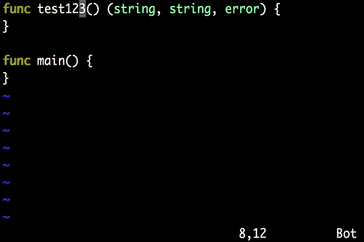

# iferr

Context-dependent error handling editor plugin for Go



## Examples

Returns the error value in the correct position, with zero values for other arguments:

```
func t2() error {
	if err != nil {
		return err
	}
}

func t3() (string, string, error) {
	if err != nil {
		return "", "", err
	}
}
```

When there's no `error` value to return, it uses `log.Fatal(err)`:

```
func main() {
	if err != nil {
		log.Fatal(err)
	}
}

func t1() (string, string) {
	if err != nil {
		log.Fatal(err)
	}

}
```

## Installation and editor integration

The command can be installed in the usual fashion:

```
go get github.com/TrustRevoked/iferr
```

You can then pass it a Go file and a byte position to generate the appropriate error handling:

```
% iferr /path/to/file.go 123
if err != nil {
return "", nil, err
}
```

### vim integration

```
function GoIfErr()
  let path = '/tmp/goiferr.txt'
  let position = line2byte(line('.'))+col('.')
  execute 'write!' path
  return system('iferr '.shellescape(path).' '.shellescape(position))
endfunction

inoremap <C-E> <C-R>=GoIfErr()<CR>
```

Then type Ctrl+E in insert mode to add the appropriate error handling code.

## License

MIT
